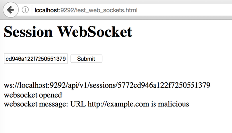

# Forestall [](https://travis-ci.org/shhavel/forestall) [](https://coveralls.io/github/shhavel/forestall?branch=master)

Server API to check websites for malicious content. Check [API Documentation](http://shhavel.github.io/)

## Models diagram


## Installation

Currently uses ruby 2.3.1. This may be changed to other version in `.ruby-version` file.

```shell
$ git clone https://github.com/shhavel/forestall.git
$ cd forestall
$ bundle install
```

Install redis, e.g. with brew

```shell
$ brew install redis
```

## Start application server

```shell
$ rackup -p 9292
```

## Test Session WebSoket

Start application and redis.

Request session key

```shell
$ curl -X POST "http://localhost:9292/api/v1/sessions" \
  -H "Content-Type: application/json" \
  -d '{"session":{"browser":"test"}}'

  {"type":"sessions","id":"5772cd946a122f7250551379","attributes":{"safe_sites_count":0,"malicious_sites_count":0}}
```

Open [http://localhost:9292/test_web_sockets.html](http://localhost:9292/test_web_sockets.html), type session id and press "Submit".

Enroll website for checking

```shell
curl -X POST "http://localhost:9292/api/v1/sites" \
  -H "Content-Type: application/json" \
  -d '{"key":"5772cd946a122f7250551379","site":{"url":"http://example.com","scripts_attributes":[{"name":"Page Content","type":"html","content":"<html>content</html>"},{"name":"http://example.com/javascripts/jqery.js","type":"javascript","content":"123"}]}}'
```

Wait while site will be processed.


